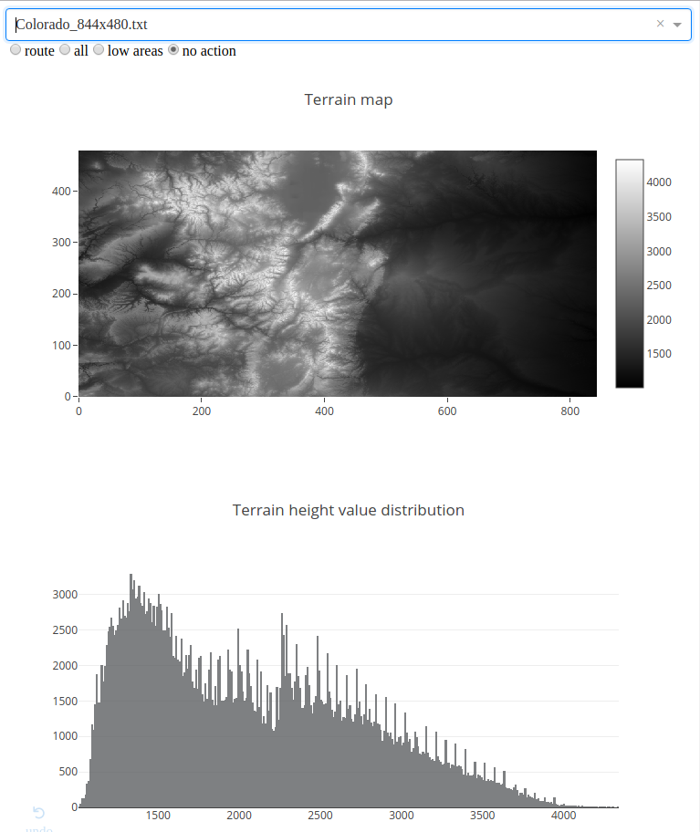
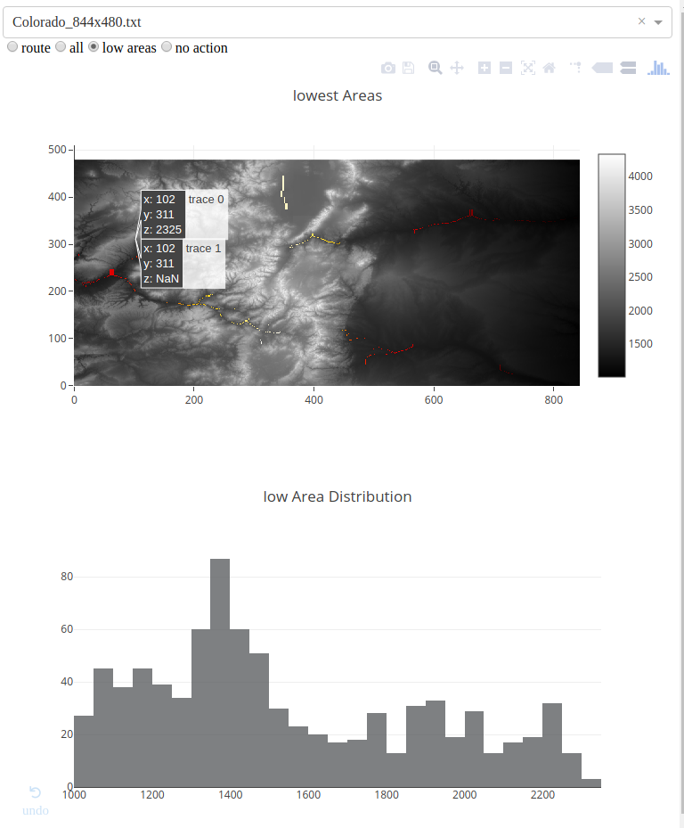
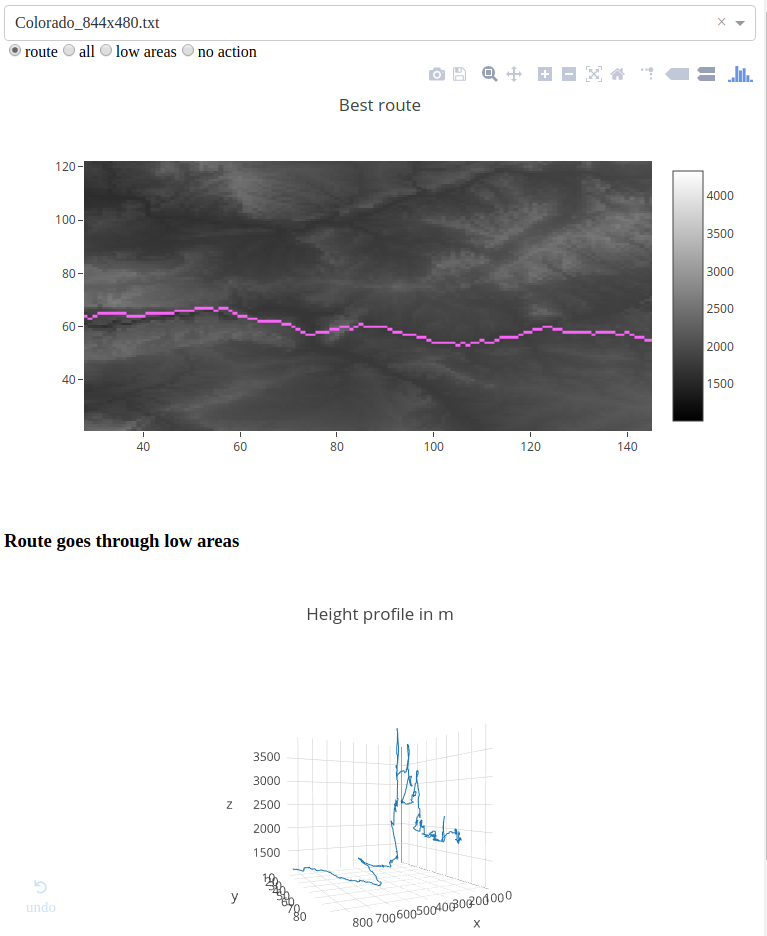

# Mountain Route project

The Mountain route web-application is able to process Terrain-files (as text-file) and output the elevation distribution, detect low-areas and calculates the best route from a start point on the terrain (best in terms of smallest elevation difference).
The Mountain route web-application was realized using the python flask framework as well as the plotly modules Dash and plotly for python.

### Installation

In order to install the web-application, it is recommended to create an virtual environment and clone the repository. All requiered python libraries can be installed via pip with the provided `requierments.txt`.
The application can be served by running the app.py file: `python app.py`, this deploys the application locally on: `localhost: 8050`.

### Adding Terrain data

New Terrain data can be added by saving them in the `./data/` folder, the data path is relative, thus platform indepent. You may need to refresh or restart the application to use the added data-file. 

### Functionality:

#### Display Terrain and elevation distribution

-----------
#### Detecting Low Areas 

----------
#### Routing

